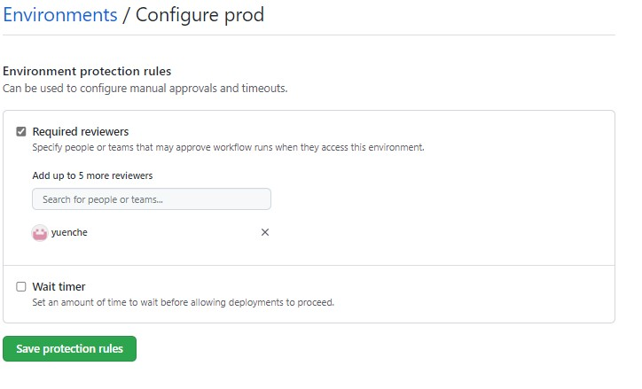

# Part 5: Continuous Deployment (CD)

## Pre-requisites
- Complete [Part 0](part_0.md), [Part 1](part_1.md), [Part 2](part_2.md), [Part 3](part_3.md) and [Part 4](part_4.md)

## Summary 

After a successful run of the CI pipeline, your team is looking to complete the process with a CD pipeline that will handle the deployment of the model to staging and production. "hot swap" is used in the example as a deployment mechanism to avoid downtime. 

The goal of this section is to build a CD pipeline to:
    
- Deploy the model to staging when a new model is generated and registered. 
- Create PR to main branch and trigger the model deployment to production. 
- Create a model API endpoint (webservice) using an Azure ML Managed Endpoint and deploy the model to the endpoint into one of the two deployment slots (blue/green slots).
    > - Test the deployment to the endpoint of the new model.
    > - On success of test, swap the deployment to accept 100% of the service endpoint traffic (and therefore become 'production').
- Add a Branch Protection rule in GitHub.
- Introduce Manual Gate to production environment 

## Steps

1. The CD workflows are defined in `.github/workflows/yc_cd_staging.yml` and `.github/workflows/yc_cd_prod.yml`. Both rely on the Azure CLI to control the infrastructure and implement the automation of the model deployments. Therefore, we need to setup this workflow to login to Azure via a Service Principal to be able to leverage the Azure CLI.

    > Action Items:
    > 1. Open up the `yc_cd_staging.yml` and `yc_cd_prod.yml` file in your repo (.github/workflow location)
    > 2. Update the 'creds: ${{ secrets...' section in this file to setup your secret name. Follow the instructions in this file annotated with #setup.triggers as part of a GitHub Actions workflow. 

2. We will now configure our Azure ML deployments, and the GitHub workflow which will automate these deployments.

    - Two files control your Azure ML deployments:
        - `/core/scoring/endpoint.yml`: this is your endpoint.
            Think of this as a virtual load balancer to the actual 'deployments' (actual web services hosting your models, i.e. deployments)
        - `/core/scoring/deployment.yml`: this defines an actual deployment to an endpoint. 

    You can have as many deployments as you want behind an endpoint. The endpoint traffic routing enables you to control which parts of the traffic to the endpoint gets routed to which deployment. In this workshop, we take the blue/green approach where we'll have 2 deployments (named green and blue respectively), which will take turn playing the role of production/staging. We only have one deployment file define though, as we automatically override the name of the deployment as part of a custom GitHub action which we'll review later in this section.
    
    Workflows in `yc_cd_staging.yml` and `yc_cd_prod.yml` load environment variables from .env files.  
    > Action Items: Configure the variables for development environment in `src/workshop/env/.env.prod`. (You have already configured `src/workshop/env/.env.staging` in Part_4 )
    > - `group`: resource group of the AML production workspace.
    > - `workspace`: the AML production workspace.
    > - `location`: the location of the AML production workspace.
    > - `compute`: the name of the compute cluster in production.
    > - `endpoint`: the name of the model endpoint in production. This name needs to be unique within the region you are deploying into as the endpoint name is part of the endpoint URI.
    > - `model`: the model name.

    As you've now noticed, 3 actions control the overall CD flow at the end of the workflow definition. Let's have a look into them in more details, feel free to open their code and review how this logic has been implemented. The key considerations for each file are as follow:
    - `.github/actions/aml-endpoint-deploy/action.yaml`: this action does quite a few things:
        - Creates an endpoint if it doesn't exist yet using your endpoint.yml definition.
        - Checks the traffic on the endpoint, which returns a list of deployments and their respective traffic. Based on that information, the action determines which deployment name to use (green or blue). The action will deploy to whichever deployment has 0% traffic (or create one if none exists yet)
        - Deploys the latest version of the model (note that the code retrieves the latest version of the model automatically and ignores the version set in the deployment.yml file) to ensure we always release the latest registered model version.
        - The deployment has a traffic of '0%' by design as we do not want to enable it to support traffic yet until it's been tested.
    - `.github/actions/aml-endpoint-test/action.yaml`: This action is quite simple and does the following:
        - Finds the deployment to test by reading the endpoint, and looking for the deployment with 0% traffic
        - Tests the 0% traffic endpoint. Note that we do not have a real test it, we just check that the endpoint is 'live' but you'd be most likely checking the output against an expected response or analyzing the response with a simple python test code. Consider looking at [Test new Deployment](https://docs.microsoft.com/en-us/azure/machine-learning/how-to-safely-rollout-managed-endpoints#test-the-new-deployment) to understand your options when it comes to testing endpoints, either via an az ml command, or by calling the endpoint URI directly but specifying a header hint to route your test request to the 0% traffic deployment.
    - `.github/actions/aml-endpoint-swap/action.yaml`: This action is also quite simple and consists of two main steps:
        - Read the endpoint to see which deployment is at 0% vs 100%
        - Operates a traffic update operation to swap around the traffic routing and effectively enabling the latest model version to support 100% of the traffic, i.e. becoming 'production'.

4. Now we are ready to run the workflows to deploy the new model generated from yc-ci-train. Please review workflow file `yc_cd_staging.yml` and `yc_cd_prod.yml` to understand how we've establised a trigger mechanism to enable a deployment of code that has successfully passed CI, and is ready to be deployed to staging and production.

   The triggers of deployment to staging `yc_cd_staging.yml`:
   - The completion of workflow `yc-ci-train`
   - Push to `integration` branch with path filter
   - 'workflow_dispatch': this enables to run the CD pipeline on demand from the GitHub UI as this will greatly facilitate testing. In practice you would eventually remove this trigger type and fully depend on the rest of the automation.

   The triggers of deployment to production `yc_cd_prod.yml`:
   - Push to `main` branch
   - 'workflow_dispatch'

   Let's trigger the CD workflows manually in this exercise.     
   > Action Items:
    > 1. Go to the GitHub UI under 'Actions', and select 'yc-cd-staging', and trigger it to run now on 'integration' branch.
    > 2. Once triggered, click on it to open up the details and monitor its execution.
    > 3. A new Pull Request is created to 'main' branch when deployment to staging is tested successful.
    > 4. Merge the Pull Request and trigger the yc-cd-prod workflow
    > 5. Once triggered, click on it to open up the details and monitor its execution.

    > Note: Run this one more time at least to observe the entire flow and the 'swap' of deployments happening automatically with each green/blue swap alternating between supporting 0% of the traffic and 100% of the traffic as they get 'pushed to production'.

5. The last step to control CD is to setup a GitHub branch protection rule to require a successful CD run to be able to merge any code into 'main'. 

    GitHub offers up an easy way to define such policy.

    > Action Items:
    > - Go to your Github repo, and click on 'Settings'
    > - Click on 'Branches' under 'Code and automation'
    > - Click on 'Add rule' next to the 'Branch protection rules' to create a new rule, keep all defaults and set the following:
    >     - Branch name pattern: main
    >     - Require a pull request before merging: CHECK
    >     - Require status checks to pass before merging: CHECK
    >     - Status checks that are required: type-in 'yc-cd-staging' in the search box and select it (it should auto-complete). This name is the job name defined in the yc_cd_staging.yml file.
    >     - Click Save Changes to enable this rule on your repo.

    You can easily test this rule by creating a pull request to main from integration.

    > Action Items:
    > 1. Create a pull request from integration to main (if you have no changes in integration, first commit a simple change in your own dev branch by adding a comment to the score.py script for instance), and bring this over to integration via a Pull Request from your dev branch to integration. Once the CI workflow has completed, a Pull Request from integration to main will be automatically created.
    > 2. Observe the status of the Pull Request to main: it should have triggered the CD run (based on the workshop_cd.yml triggers definition), and there should be a rule that prevents merging the Pull Request until the CD workflow completes successfully.

6. You can also implement a manual gate to introduce manual approval process prior to production deployment. It can be done by setting environment protection rules in GitHub. Please follow the [guide](https://cloudlumberjack.com/posts/github-actions-approvals/). 

    > 

## Success criteria

- The CD pipeline runs sucessfully each time a CI training workflow completes. Please test this by triggering a new CI run or trigger the workflow manually.
- Each CD run updates the deployment which is currently at 0%, and then swaps it to 100% once tested properly via the CD test custom action.

## Reference materials

- [GitHub Actions](https://github.com/features/actions)
- [GitHub Actions: Workflow Triggers](https://docs.github.com/en/actions/using-workflows/events-that-trigger-workflows)
- [Github Actions: Use the Azure login action with a service principal secret](https://docs.microsoft.com/en-us/azure/developer/github/connect-from-azure?tabs=azure-portal%2Cwindows#use-the-azure-login-action-with-a-service-principal-secret)
- [Azure ML CLI v2](https://docs.microsoft.com/en-us/azure/machine-learning/how-to-train-cli)
- [Azure ML CLI v2 Examples](https://github.com/Azure/azureml-examples/tree/main/cli)
- [Azure ML Managed Endpoints](https://docs.microsoft.com/en-us/azure/machine-learning/how-to-deploy-managed-online-endpoints)
- [Azure ML Safe Rollout of Managed Endpoints](https://docs.microsoft.com/en-us/azure/machine-learning/how-to-safely-rollout-managed-endpoints)

## Congratulations!

This completes this workshop. We hope you've learned a lot of key concepts and are ready to take this as a template to customize for your own needs and accelerate your ML use cases.
